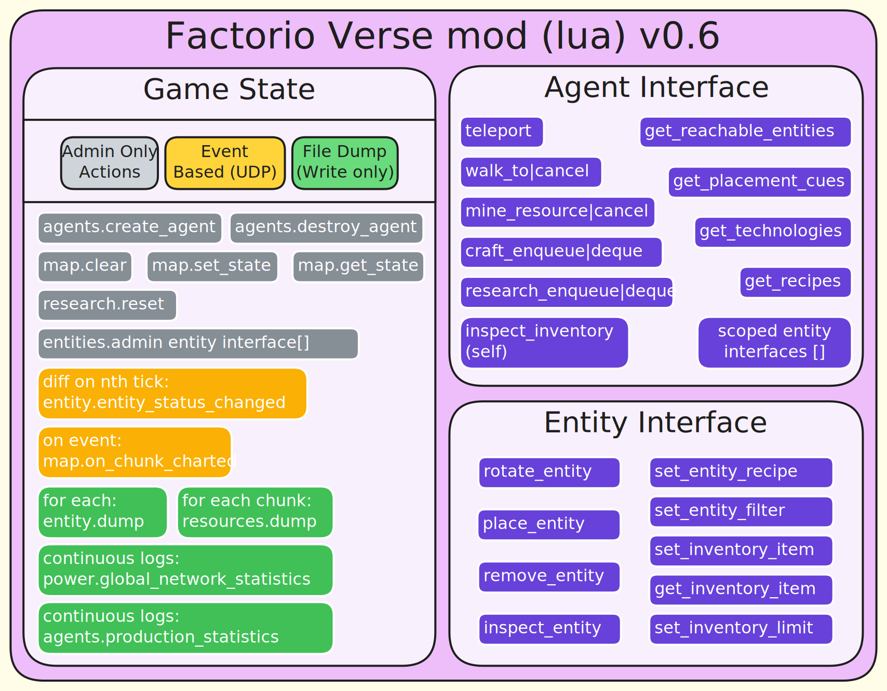

# FactoryVerse

This repository explores the intersection of Large Language Models and complex systems optimization through the lens of Factorio gameplay. FactoryVerse treats Factorio not as a collection of objects to manipulate, but as a rich, spatial dataset to be analyzed, queried, and optimized at scale.

## Research Motivation

FactoryVerse investigates three core research questions that form the foundation for scalable, data-driven AI agents in complex simulation environments:

### 1. Scalable Mod Architecture for Embodied Agents

**How can we design a mod architecture that scales for multiple embodied agents in Factorio-based gameplay?**

Inspired by the agent ecosystems of Minecraft, FactoryVerse implements an extensive design for multi-agent gameplay that serves as the core basis for building diverse environments on top of Factorio's sandbox mechanics. The **FV Embodied Agent** mod provides:

- **Agent Class System**: Each agent is a fully-featured entity with its own character, force, inventory, and state machines
- **Multi-Agent Coordination**: Agents can operate independently or collaboratively, with configurable force relationships
- **Action System**: Comprehensive action interface covering walking, mining, crafting, placement, research, and entity operations
- **State Machine Processing**: Tick-based processing for concurrent agent activities (walking, mining, crafting)
- **UDP Notification System**: Real-time event notifications for research completion, action results, and game state changes
- **Remote Interface**: Python-accessible RCON interface for external agent control

This architecture enables researchers to build complex multi-agent scenarios, test coordination strategies, and evaluate agent performance in a rich, dynamic environment.

### 2. Optimal LLM Context Provision

**What is the best way to provide context to LLMs for embodied gameplay?**

FactoryVerse takes an opinionated approach: **materialize the entire game state to disk and provide LLMs with SQL query access to a real-time updated spatial database**. The **FV Snapshot** mod implements this vision:

- **Comprehensive State Serialization**: Writes all game entities, resources, map data, power networks, and research state to disk as structured CSV files
- **Snapshot Categories**: Modular snapshot system for Resources, Entities, Map chunks, Power networks, and Research state
- **Incremental Updates**: Efficient upsert-friendly output format for streaming updates as the game evolves
- **DuckDB Integration**: Python agents load snapshots into DuckDB with spatial extensions (PostGIS) for sophisticated queries
- **Real-Time Synchronization**: Continuous snapshot updates provide agents with current map state without polling the game engine

This approach transforms implicit visual information (sprite animations, coverage indicators, flow rates) into explicit, queryable data. Instead of asking "what do I see?", agents ask "what resources are within 50 tiles?" or "which drills lack power coverage?"

### 3. DSL for State Representation

**What DSL best enables LLMs to interface with stateful game entities?**

Factorio entities are inherently stateful—furnaces have fuel levels, assemblers have recipes, inserters have pickup/drop positions. Human players understand this through visual cues: animated sprites, colored overlays, range indicators. LLMs need a different interface.

FactoryVerse provides an **object-oriented Python DSL** that instantiates entities with all their affordances explicitly represented:

- **Type-Safe Entity Classes**: `Furnace`, `AssemblingMachine`, `Inserter`, `MiningDrill`—each with domain-specific methods
- **Explicit Affordances**: Methods like `furnace.add_fuel()`, `drill.output_position()`, `inserter.get_drop_position()` make implicit game mechanics explicit
- **Composable Operations**: LLMs write Python code combining spatial queries (DuckDB) with entity operations (DSL)
- **Context-Aware Execution**: All operations execute within a `playing_factorio()` context that manages RCON connections and game state
- **Prototype-Driven Behavior**: Static entity properties (output positions, search areas) derived from Factorio's prototype data ensure accuracy

This DSL bridges the gap between human visual understanding and LLM code generation, enabling agents to reason about and manipulate complex factory systems through composable Python code.

---

## Working with This Repository

FactoryVerse provides two primary entry points for different use cases:

### CLI Entry Point

The CLI (`src/FactoryVerse/cli.py`) manages Factorio servers, Jupyter notebooks, and client setup:

```bash
# Launch Factorio client with FactoryVerse mods
uv run python -m FactoryVerse.cli client launch --as-mod --scenario test_scenario

# Start Factorio server(s) with Jupyter notebook
uv run python -m FactoryVerse.cli server start --num 1 --scenario test_scenario --as-mod

# View server logs
uv run python -m FactoryVerse.cli server logs factorio_0 --follow

# Stop all services
uv run python -m FactoryVerse.cli server stop
```

**Key Features:**
- Docker-based server orchestration with Jupyter integration
- Hot-reload support for rapid development (scenario mode only)
- Multi-server support for parallel experiments
- Client setup automation (mod installation, scenario configuration)

### Agent Runtime Entry Point

The agent runtime (`scripts/run_agent.py`) provides an LLM-powered agent that plays Factorio:

```bash
# Interactive mode with model selection
uv run python scripts/run_agent.py

# Specify model directly
uv run python scripts/run_agent.py --model intellect-3

# List available models
uv run python scripts/run_agent.py --list-models

# List existing sessions
uv run python scripts/run_agent.py --list-sessions
```

**Key Features:**
- **Session Management**: Automatic session tracking with chat logs, notebooks, and initial state snapshots
- **LLM Integration**: Currently supports Prime Intellect credits inference API
- **Real-Time Console Output**: Displays agent reasoning, function calls, and results as they happen
- **Jupyter Notebook Logging**: All DSL and SQL executions logged to persistent notebook for review
- **Initial State Generation**: Comprehensive map summary provided to agent at startup
- **Interactive Mode**: Chat with the agent, provide guidance, view statistics

**Configuration:**
Set `PRIME_API_KEY` in your `.env` file to use the Prime Intellect API.

---

## Technical Deep Dive

### FV Embodied Agent Mod

The **FV Embodied Agent** mod (`src/fv_embodied_agent/`) implements the core agent infrastructure:

**Agent Class (`Agent.lua`):**
- **Lifecycle Management**: `Agent:new()`, `Agent:destroy()`, force creation/merging
- **State Machines**: Consolidated state for walking, mining, and crafting activities
- **Action Methods**: Mixed in from modular action files:
  - `walking.lua`: Pathfinding, waypoint navigation, goal adjustment for entity collision
  - `mining.lua`: Incremental and deplete modes, stochastic product handling
  - `crafting.lua`: Queue management, progress tracking, completion notifications
  - `placement.lua`: Entity placement with validation, ghost placement, placement cues
  - `entity_ops.lua`: Recipe setting, inventory management, entity pickup
  - `researching.lua`: Technology queue management, research status
  - `reachability.lua`: Entity and resource queries within reach distance

**Remote Interface:**
Each agent registers a per-agent remote interface (`agent_{agent_id}`) accessible via RCON, enabling Python DSL to invoke actions like:
- `remote.call("agent_1", "walk_to", {x=100, y=200})`
- `remote.call("agent_1", "mine_resource", {resource_name="iron-ore", max_count=25})`
- `remote.call("agent_1", "craft_enqueue", {recipe_name="iron-plate", count=10})`

**UDP Notifications:**
Agents enqueue messages for important events (research complete, action completion) which are sent via UDP to Python listeners. This enables reactive agent behavior without polling.

**Multi-Agent Support:**
- Each agent has its own force with configurable relationships
- Agents can share technology trees or research independently
- Rendering labels (name tags, map markers) for visual identification

### FV Snapshot Mod

The **FV Snapshot** mod (`src/fv_snapshot/`) materializes game state to disk for database loading:

**Snapshot System (`game_state/` modules):**
- **Entities.lua**: Serializes all placed entities with components (belts, inserters, drills, assemblers, inventories, recipes)
- **Resource.lua**: Streams resource tiles (ores) and entities (trees, rocks) with clustering into patches
- **Map.lua**: Tracks charted chunks, manages snapshot phases (initialization vs maintenance)
- **Power.lua**: Captures electric network topology and coverage areas
- **Research.lua**: Exports technology tree state, research progress, unlocked recipes

**Output Format:**
- CSV files with headers for efficient bulk loading into DuckDB
- Compression support for large datasets
- Incremental updates with entity keys for upsert operations
- JSON columns for complex nested data (inventories, connection points)

**Event Dispatcher (`control.lua`):**
- Aggregates event handlers from all game state modules
- Registers nth-tick handlers for periodic status tracking
- Manages system phases to avoid performance overhead during initialization

**Integration with Python:**
Python loaders (`src/FactoryVerse/infra/db/loader/`) read snapshot CSVs and populate DuckDB tables, enabling agents to query game state via SQL.

### Python DSL (Broad Strokes)

The Python DSL (`src/FactoryVerse/dsl/`) provides a type-safe interface to Factorio:

**Core Concepts:**
- **Context Manager**: `playing_factorio()` establishes RCON connection and agent context
- **Accessor Modules**: `walking`, `mining`, `crafting`, `research`, `inventory`, `reachable`, `ghost_manager`, `map_db`
- **Entity Types**: `Furnace`, `AssemblingMachine`, `Inserter`, `MiningDrill`, `TransportBelt`, `ElectricPole`, `Container`
- **Item Types**: `Item`, `ItemStack`, `PlaceableItem`, `MiningDrillItem` (with placement cues)
- **Type Classes**: `MapPosition`, `Direction`, `BoundingBox`

**Accessor Patterns:**
```python
with playing_factorio():
    # Walking
    await walking.to(MapPosition(100, 200))
    
    # Mining (max 25 items per operation)
    resources = reachable.get_resources("iron-ore")
    await resources[0].mine(max_count=25)
    
    # Crafting
    await crafting.craft("iron-plate", count=10)
    crafting.enqueue("copper-plate", count=50)
    
    # Inventory
    iron_count = inventory.get_total("iron-plate")
    
    # Entity operations
    furnace = reachable.get_entity("stone-furnace")
    furnace.add_fuel(coal_stack)
    furnace.add_ingredients(ore_stack)
    
    # Database queries
    result = map_db.connection.execute("SELECT * FROM resource_patch").fetchall()
```

**Entity Methods:**
Each entity type has domain-specific methods reflecting its gameplay role:
- `Furnace`: `add_fuel()`, `add_ingredients()`, `take_products()`
- `AssemblingMachine`: `set_recipe()`, `get_recipe()`
- `Inserter`: `get_pickup_position()`, `get_drop_position()`
- `MiningDrill`: `output_position()`, `get_search_area()`, `place_adjacent()`
- `TransportBelt`: `extend(turn=None)`
- `ElectricPole`: `extend(direction, distance=None)`

### DuckDB Schemas (Broad Strokes)

The DuckDB schema (`src/FactoryVerse/infra/db/duckdb_schema.py`) provides a spatial database for map queries:

**Core Tables:**
- `resource_tile`: Individual ore tiles with position and amount
- `resource_entity`: Trees, rocks with bounding boxes
- `map_entity`: All placed entities (drills, furnaces, belts, etc.) with spatial geometry
- `entity_status`: Current operational status (working, no_power, no_fuel)

**Component Tables:**
- `inserter`: Direction, input/output positions and connected entities
- `transport_belt`: Direction, input/output connections for belt networks
- `electric_pole`: Supply area geometry, connected poles
- `mining_drill`: Mining area geometry, output position
- `assemblers`: Current recipe

**Patch Tables:**
- `resource_patch`: Clustered ore patches with total amount, centroid, geometry
- `water_patch`: Water tile clusters with coastline length
- `belt_line`: Belt network topology with line segments

**Spatial Types:**
- Uses DuckDB spatial extension (PostGIS-compatible)
- `GEOMETRY` columns for bounding boxes, areas, lines
- `POINT_2D` for centroids
- RTREE indexes for efficient spatial queries

**ENUM Types:**
Dynamically generated from Factorio prototype data:
- `recipe`: All craftable recipes
- `resource_tile`: Ore types (iron-ore, copper-ore, coal, stone, crude-oil)
- `placeable_entity`: All placeable entity names
- `direction`: North, East, South, West, etc.
- `status`: working, no_power, no_fuel, etc.

**Example Queries:**
```sql
-- Find nearest iron ore patches
SELECT patch_id, total_amount, 
       ST_Distance(centroid, ST_Point(0, 0)) AS distance
FROM resource_patch 
WHERE resource_name = 'iron-ore'
ORDER BY distance ASC;

-- Find drills without power coverage
SELECT d.entity_key, m.position
FROM mining_drill d
JOIN map_entity m ON d.entity_key = m.entity_key
WHERE m.electric_network_id IS NULL;

-- Find water sources for offshore pumps
SELECT patch_id, coast_length, total_area
FROM water_patch
WHERE coast_length > 20
ORDER BY coast_length DESC;
```

---

## How Factorio Gameplay Works

Understanding Factorio's core progression is essential for designing effective AI agents. The gameplay follows a tightening flywheel pattern:

### Primary Loop
1. **Prospect → Extract**: Locate resource patches; transition from manual mining to automated drilling systems
2. **Process → Assemble**: Smelt raw ores into intermediate materials; construct science pack production chains
3. **Research → Unlock**: Feed science packs to laboratories to advance the technology tree, unlocking higher-tier automation
4. **Scale → Optimize**: Expand production throughput, refactor inefficient layouts, increase sustained science-per-minute
5. **External Pressure → Defend**: Manage pollution-driven enemy evolution; clear expansion areas and establish defensive perimeters
6. **Culminate → Launch**: Construct and fuel a rocket silo; launching the satellite triggers primary victory condition

### Post-Victory Loop (Optional)
7. **Infinite Research**: Rocket launches yield space science packs that fuel repeating technologies, enabling long-term factory optimization beyond the win condition

### Success Criteria
- **Primary**: First rocket launch (victory screen)
- **Secondary**: Sustainable defense against evolving enemies, increasing science-per-minute throughput, continuous technological progression

The loop forms an accelerating flywheel: **Extract → Automate → Research → Scale → Repeat → Launch** — with steady-state infinite research sustaining long-horizon optimization.

---

## Context on the Table

<p align="center">
  
</p>

Rather than relying on visual interpretation or reactive object access, FactoryVerse makes implicit game context explicit through a queryable spatial database approach:

### Spatial Intelligence
- **PostGIS Integration**: Leverage mature spatial database capabilities for complex geometric queries
- **Multi-Scale Queries**: Query factory state at different levels of abstraction (entity-level → spatial-level → global logistics)
- **Proximity Analysis**: Identify spatial relationships, coverage gaps, and optimization opportunities

### Temporal Analytics  
- **Production Flow Analysis**: Track resource throughput rates, identify bottlenecks, and optimize production ratios
- **Evolution Tracking**: Monitor pollution spread, enemy base expansion, and defensive coverage over time
- **Performance Metrics**: Sustained science-per-minute, resource efficiency, and factory growth patterns

This is attempting an opinionated equivalence between the game state mapped onto SQL tables.

### Context Materialization
Instead of requiring LLMs to infer context from visual cues, FactoryVerse materializes this information as queryable data:

```sql
-- Find the best iron ore patches near your factory
SELECT 
  resource_name,
  total_amount,
  ST_Distance(centroid, ST_Point(0, 0)) AS distance_from_spawn
FROM resource_patch 
WHERE resource_name = 'iron-ore'
ORDER BY total_amount DESC, distance_from_spawn ASC;

-- Check which resources aren't being mined yet
SELECT resource_name, COUNT(*) as uncovered_patches
FROM resource_patch rp
WHERE NOT EXISTS (
  SELECT 1 FROM map_entity e 
  JOIN mining_drill d ON e.entity_key = d.entity_key
  WHERE ST_DWithin(rp.centroid, ST_Point(e.position.x, e.position.y), 2)
)
GROUP BY resource_name;

-- Find water sources for offshore pumps
SELECT patch_id, coast_length, total_area
FROM water_patch
WHERE coast_length > 20
ORDER BY coast_length DESC;
```

### Architecture Benefits

1. **Analytical Reasoning**: Enables system-level optimization rather than purely reactive object manipulation
2. **Scalable Observation**: Query exactly what's needed rather than loading entire game state
3. **Flexible Abstraction**: Create novel views and analyses

---

## Appendix

### Spatial Types

Factorio is a 2D grid-based world. The relevant game world precision is integer level, if you ignore real player position, vehicle position, and mine placement. In other words, everything else on the map snaps to an integer coordinate grid, with the smallest 1×1 size of this world called a tile.

While entities have centers that can be at half-tile coordinates (e.g., x + 0.5), we can represent them using their bottom-left corner coordinates and dimensions instead. This transformation converts all spatial data to integer coordinates, enabling fast spatial indexing and efficient database queries.

**Spatial Types (ST) Standards**: PostGIS implements the OGC Simple Features specification, providing standardized geometry types for spatial databases. For Factorio's 2D grid world, the most relevant types are: **Point** (entity centers, resource deposits), **Polygon** (building footprints, resource patches), **LineString** (conveyor belts, pipe networks), and **MultiPolygon** (complex resource areas). These types enable precise spatial queries like proximity analysis, coverage calculations, and optimal routing—transforming Factorio's implicit spatial relationships into queryable database operations.

---

*FactoryVerse: Complex Systems need Intelligent Analysis*