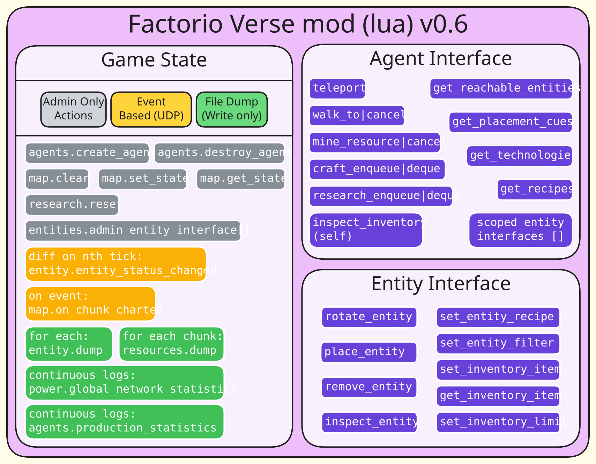

# FactoryVerse

FactoryVerse is a multi-layered platform addressing a critical gap in AI Agent Research in Factorio. To this effect it provides a comprehensive low-level scaffolding for developing embodied agents in Factorio, developed for scaling multi-agent research via the **FV Embodied Agent** mod. While the **FV Snapshot** mod, fills the gap of reading the massive map state in a deterministic and non-blocking manner. These two core mods provide a stable foundation for doing high-level, composable agent research in Factorio.
Beyond the core foundation, FactoryVerse also explores an opinionated design to enhance the LLM Agent's ability for interacting and reasoning about the complex factorio game state. This is achieved by providing **High-level Action** and **Factory Object** interfaces that wrap the underlying low-level RCON calls into an **Object-Oriented Markov Decision Process (OOMDP)** interface, for agent control and entity interaction. While the complex game state is materialized via a real-time synchronized DuckDB database, providing an equivelence between the Remote View (map) screen available to human players via the GUI.

## What FactoryVerse Provides

FactoryVerse ships four integrated components:

### 1. **FV Embodied Agent Mod** (`src/fv_embodied_agent/`)
A Factorio mod that implements multi-agent gameplay infrastructure. Each agent is a fully-featured entity with its own character, force, inventory, and state machines. The mod exposes 30+ low-level action methods via Factorio's remote interface system, enabling external control through RCON.

### 2. **FV Snapshot Mod** (`src/fv_snapshot/`)
A Factorio mod that materializes game state to disk as append-only JSONL files. Every entity placement, resource extraction, and chunk charting event is captured deterministically and written to disk—providing a complete audit trail of game state.

### 3. **Factory Objects** (`src/FactoryVerse/factory/`)
Type-safe, stateful Python abstractions that wrap the mod's remote interface into an **OOMDP**. Instead of calling 30+ stateless RCON functions, agents interact with objects like `Furnace`, `MiningDrill`, and `AssemblingMachine` that have domain-specific methods (`add_fuel()`, `set_recipe()`, `output_position()`). These objects mirror the GUI interactions human players use.

### 4. **Top-Level Accessors & DuckDB Integration**
Python accessors that provide two complementary query interfaces:
- **`Reachable View`**: Query entities and resources within interaction range (full mutation access)
- **`Remote View`**: Query entities anywhere on the map via SQL (read-only, then walk to interact)
- **`Ghost Entity`**: In-built dry run placement for entities, useful for planning large-scale construction

The snapshot mod's JSONL files are loaded into a **DuckDB spatial database** (`src/FactoryVerse/agent/infra/snapshot/`) that stays synchronized with game state in real-time via UDP. This enables agents to query the entire map with SQL instead of processing screenshots.

## Research Motivation

FactoryVerse investigates three core research questions:

### 1. Scalable Mod Architecture for Multi-Agent Gameplay
**How can we design a mod architecture that scales for multiple embodied agents in Factorio?**

The FV Embodied Agent mod provides a simple, extensible foundation for multi-agent scenarios. Each agent operates independently, actions like walking, mining, and crafting use async contracts (UDP notifications) to enable non-blocking, concurrent agent behavior. This is inspired by the many existing Multi-Agent sandbox environments.

### 2. Database as Proxy for Multi-Scale Vision
**Is a database a good proxy for multi-scale vision in embodied gameplay?**

Rather than only processing screenshots, FactoryVerse materializes entire game state to disk and provides SQL query access to a real-time spatial database. Factorio's deterministic simulation guarantees that event handlers capture exact game state—every change is written to disk as a set of initial dump and subsequent append-only JSONL files. In Factorio's lua runtime, reading game state directly via rcon blocks the runtime, making the snapshot system essential for scaling multi-agent game state reads. UDP sync provides real-time updates for performance, but the file-based record ensures deterministic source of truth as fallback: if UDP drops packets, sequence gaps trigger reconstruction from disk files.

### 3. Action Wrappers and Object-Oriented MDP for LLM Agents
**What abstraction best enables LLMs to interface with stateful game entities?**

High-level actions wrap the stateful life cycles for async actions and the underlying UDP contracts provided by the embodied agent mod into a more user-friendly interface via python classes. They also provide entry points for instantiating factory objects.
Factory objects create an OOMDP abstraction that mirrors GUI interactions. Instead of calling low-level RCON functions with positional arguments and manual serialization, agents interact with stateful objects that have explicit affordances. This bridges the gap between human visual/interactive understanding and LLM code generation.

---

## Installation

### Development (Editable Install)

Clone the repository and install with [uv](https://docs.astral.sh/uv/):

```bash
# Clone repository
git clone https://github.com/hrshtt/FactoryVerse.git
cd FactoryVerse

# Install in editable mode with dev dependencies
uv pip install -e .
uv sync --group dev

# Copy and configure environment
cp .env.example .env
# Edit .env with your API keys and settings
```

### From Repository (Non-Editable)

```bash
# Install directly from GitHub
uv pip install git+https://github.com/hrshtt/FactoryVerse.git
```

---

## Working with This Repository

FactoryVerse provides two CLI entry points: `factoryverse` (full name) and `fv` (alias).
FactoryVerse mods (`fv_embodied_agent` + `fv_snapshot`) are **always loaded**.

### CLI Entry Point

The CLI manages Factorio instances, servers, and data:

```bash
# Instance management
uv run fv instance list        # List all instances and their status
uv run fv instance active      # Show currently active instance

# Launch Factorio client with FactoryVerse mods
uv run fv client launch --scenario test-ground

# Start Factorio server(s) with Jupyter notebook
uv run fv server start --num 1 --scenario test-ground

# Hot-reload scenario files during development (repo scenarios only)
uv run fv server start --scenario test-ground --watch

# View server logs
uv run fv server logs factorio_0 --follow

# Stop all services
uv run fv server stop

# Data management
uv run fv data prune           # Prune data-raw-dump.json → factorio-data-dump.json
uv run fv data refresh         # Find and prune in one step

# List available scenarios
uv run fv server list-scenarios
```

**Key Features:**
- Docker-based server orchestration with Jupyter integration
- Hot-reload support for repo scenarios (`--watch` flag)
- Multi-server support for parallel experiments
- Client setup automation (mod installation, scenario configuration)
- Live instance detection with collision handling

### Agent Runtime Entry Point

The agent runtime (`scripts/run_agent.py`) provides an LLM-powered agent that plays Factorio:

```bash
# Interactive mode with model selection
uv run scripts/run_agent.py

# Specify model directly
uv run scripts/run_agent.py --model intellect-3

# List available models
uv run scripts/run_agent.py --list-models

# List existing sessions
uv run scripts/run_agent.py --list-sessions
```

**Key Features:**
- **Session Management**: Automatic session tracking with chat logs, notebooks, and initial state snapshots
- **LLM Integration**: Currently supports Prime Intellect credits inference API
- **Real-Time Console Output**: Displays agent reasoning, function calls, and results as they happen
- **Jupyter Notebook Logging**: All factory object operations and SQL queries logged to persistent notebook (`.ipynb`) for review and replay
- **Initial State Generation**: Comprehensive map summary provided to agent at startup (resource patches, technologies, inventory)
- **Interactive Mode**: Chat with the agent, provide guidance, view statistics

**Configuration:**
Set `PRIME_API_KEY` in your `.env` file to use the Prime Intellect API.

---

## Technical Deep Dive

### Infrastructure Architecture

FactoryVerse's infrastructure is designed for **multi-agent, multi-instance isolation** and **real-time synchronization**. The system uses incremental port allocation to support multiple concurrent Factorio instances without conflicts, enabling parallel experiments with complete isolation.

FactoryVerse maintains real-time synchronization between Factorio (Lua) and Python through a layered approach: the `fv_snapshot` mod writes game state to JSONL files on disk, Python loads these into DuckDB, and UDP provides real-time incremental updates. This design ensures disk files serve as the deterministic source of truth, while UDP sync provides performance optimization with automatic fallback to disk replay if packets are dropped.

**Why UDP is Necessary for Async Actions:**

Factorio's RCON (Remote Console) executes commands synchronously within a single game tick—the simulation pauses, runs Lua code, and returns results atomically. While this works for fast operations like `inspect_entity` or `place_entity`, some actions cannot complete within one tick because they rely on Factorio's internal simulation systems that operate over multiple ticks:

- **Walking**: A* pathfinding and character movement happen incrementally
- **Crafting**: Recipes process over time based on crafting speed (e.g., 0.5 seconds = 30 ticks)
- **Mining**: Resource extraction is progressive based on mining speed
- **Research**: Technologies unlock over many ticks based on research speed and lab count

The problem: RCON returning only confirms the action *started*, not that it completed. Instead of polling RCON every tick (wasteful and blocks multi-agent orchestration), FactoryVerse uses UDP notifications: each agent maintains state machines in Lua that send UDP notifications when actions complete, enabling non-blocking, concurrent agent operations.

*(See Appendix A for detailed port allocation, RCON execution model, sync services implementation, and configuration management.)*

### FV Embodied Agent Mod

The **FV Embodied Agent** mod (`src/fv_embodied_agent/`) implements the core agent infrastructure—a **simple, extensible, modular, barebones** foundation for multi-agent gameplay.

**Agent Class (`Agent.lua`):**
- **Lifecycle Management**: `Agent:new()`, `Agent:destroy()`, force creation/merging
- **State Machines**: Consolidated state for walking, mining, and crafting activities
- **Action Methods**: Mixed in from modular action files in `agent_actions/`:
  - `walking.lua`: Pathfinding, waypoint navigation, goal adjustment for entity collision
  - `mining.lua`: Incremental and deplete modes, stochastic product handling
  - `crafting.lua`: Queue management, progress tracking, completion notifications
  - `placement.lua`: Entity placement with validation, ghost placement, placement cues
  - `entity_ops.lua`: Recipe setting, inventory management, entity pickup
  - `researching.lua`: Technology queue management, research status
  - `reachability.lua`: Entity and resource queries within reach distance

**Remote Interface:**
Each agent dynamically registers a per-agent remote interface (`agent_{agent_id}`) accessible via RCON, exposing 30+ low-level action methods. These methods are the **low-level primitives** that factory objects wrap into a higher-level OOMDP. This also provides the scaffolding for future extensibility for other paradigms inside the game like bots, trains, biters, etc. with modular action spaces.

**Multi-Agent Support:**
- Each agent has its own force with configurable relationships
- Agents can share technology trees or research independently
- Rendering labels (name tags, map markers) for visual identification

*(See Appendix A.4 for detailed Factorio remote interface reference and method catalog.)*

### FV Snapshot Mod

The **FV Snapshot** mod (`src/fv_snapshot/`) materializes game state to disk for database loading—implementing the **database as proxy for multi-scale vision** research question.

**Snapshot System (`game_state/` modules):**
- **Entities.lua**: Serializes all placed entities with components (belts, inserters, drills, assemblers, inventories, recipes)
- **Resource.lua**: Streams resource tiles (ores) and entities (trees, rocks) with clustering into patches
- **Map.lua**: Tracks charted chunks, manages snapshot phases (initialization vs maintenance)
- **Power.lua**: Captures electric network topology and coverage areas
- **Research.lua**: Exports technology tree state, research progress, unlocked recipes

**Two-Phase Snapshotting:**

**Phase 1: Bootstrap Mode** (Initial Snapshotting)
- **Trigger**: Map generation completes, all starting chunks charted
- **Process**: Lua runs `find_entities_filtered()` on all initially charted chunks, serializes to JSONL files with batching to prevent game freezes. Python discovers and loads these files into DuckDB, building derived tables via spatial clustering.
- **Output**: Complete spatial database snapshot of initial game state

**Phase 2: Maintenance Mode** (Real-Time Sync)
- **Trigger**: Bootstrap complete, agents start playing
- **Process**: Event handlers (`on_built_entity`, `on_mined_entity`, `on_chunk_charted`) capture changes, writing to disk as append-only logs (source of truth) and emitting UDP notifications (performance optimization). Python's `SyncService` subscribes to UDP, applies incremental updates, and detects sequence gaps to trigger disk replay if packets are dropped.
- **Guarantee**: Disk files are the proof—UDP can miss packets, but determinism + append-only log ensures exact reconstruction

**Integration with Python:**

The `RemoteView` class (`src/FactoryVerse/agent/remote_view.py`) provides the Python interface:

```python
view = RemoteView(snapshot_dir, udp_dispatcher=dispatcher)
await view.load()  # Load JSONL snapshots into DuckDB
await view.start()  # Start real-time UDP sync

# Query entities anywhere on map (returns RemoteViewEntity instances)
drills = view.get_entities("SELECT * FROM map_entity WHERE entity_name = 'burner-mining-drill'")

# Query ghosts for construction planning
pending = view.get_ghosts("SELECT * FROM ghost WHERE ghost_name = 'assembling-machine-1'")
```

*(See Appendix A.5 for detailed file structure, output format, event dispatcher, and architecture components.)*

### Python Factory Objects

The Python **Factory Objects** (`src/FactoryVerse/factory/`) provide a type-safe, object-oriented interface to Factorio—wrapping the RCON interface exposed by `fv_embodied_agent` with stateful, composable abstractions.

**Core Concepts:**
- **Accessor Modules**: `walking`, `mining`, `crafting`, `research`, `inventory`, `reachable_view`, `remote_view`
- **Entity Types**: `Furnace`, `AssemblingMachine`, `Inserter`, `MiningDrill`, `TransportBelt`, `ElectricPole`, `Container`
- **Item Types**: `Item`, `ItemStack`, `PlaceableItem`, `MiningDrillItem` (with placement cues)
- **Type Classes**: `MapPosition`, `Direction`, `BoundingBox`

**Entity View System:**
Two access modes enforce proximity-based access control (defined by `EntityView` enum):

- **REMOTE View** (read-only): Returned by `remote_view.get_entities(sql)`
  - Allows: Spatial queries, prototype data, `inspect()`, planning calculations
  - Blocks: Mutations (`pickup()`, `add_fuel()`, `set_recipe()`, `build()`)
  - Use case: Query entities anywhere on map for planning, then navigate to them for interaction

- **REACHABLE View** (full access): Returned by `reachable_view.get_entity(name)`
  - Allows: Everything—all spatial, planning, AND mutation methods
  - Methods depend on entity's mixins (FuelableMixin, CrafterMixin, ContainerMixin, etc.)
  - Use case: Interact with nearby entities (within reach distance)

**Ghost Property:**
`is_ghost` is a boolean property of `BaseEntity`:

- **Ghost Entities** (`entity.is_ghost == True`): Returned by `item.place_ghost(pos)` or `remote_view.get_ghosts(sql)`
  - Placeholders for entities to be built
  - Appear in spatial queries for construction planning
  - Special methods: `build()` (REACHABLE only), `remove()` (both views)
  - Blocks: All state mutations (ghosts have no live state—no fuel, no recipe, no inventory)
  - `inspect()` returns static data describing the planned entity

**View + Ghost Interaction:**
- **REMOTE + ghost**: Can inspect and remove, cannot build
- **REACHABLE + ghost**: Can inspect, remove, AND build (requires proximity)
- **REMOTE + real entity**: Can inspect, cannot mutate
- **REACHABLE + real entity**: Full access to all operations

**Why Factory Objects Instead of Direct Remote Calls?**

While the `fv_embodied_agent` mod exposes a complete remote interface (`remote.call("agent_1", "walk_to", {x=100, y=200})`), calling these functions directly via RCON has fundamental limitations:

- **Stateless**: Each `remote.call()` is isolated—no object identity or persistent entity references
- **Stringly-Typed**: All data passes as JSON strings through RCON—no type safety, no dynamic property access
- **Positional Arguments**: Remote calls use unnamed Lua table arguments—error-prone for methods with many parameters
- **No inherit Composition**: Cannot implicitly chain operations or build reusable references (e.g., "this furnace at position X")
- **Manual Serialization**: Must manually parse data from return types to parameters across calls
- **Procedural, Not Object-Oriented**: No encapsulation of entity state—every operation requires passing position/name explicitly

**The OOMDP Solution**:

Factory objects create an **OOMDP abstraction** that mirrors the GUI interactions human players use:

**Example Comparison**:

```python
# Low-level remote interface (30+ stateless functions):
# Every operation requires explicit agent_id, position, serialization
rcon.send_command(
    "/c rcon.print(helpers.table_to_json("
    "remote.call('agent_1', 'inspect_entity', 'stone-furnace', {x=10, y=20})"
    "))"
)
result = json.loads(rcon.response)
# Now manually parse result, check fuel, decide what to do...

rcon.send_command(
    "/c rcon.print(helpers.table_to_json("
    "remote.call('agent_1', 'put_inventory_item', 'coal', 5, 'stone-furnace', {x=10, y=20})"
    "))"
)
# Repeat for every interaction...

# Get persistent object reference
furnace = reachable_view.get_entity("stone-furnace")

# Object knows its own position and state
print(furnace.inspect())  # Human-readable formatted output

# Type-safe methods
coal_stack = inventory.get_item("coal", count=5)
furnace.add_fuel(coal_stack)  # Entity-specific affordance

# Compose operations naturally
ore_stack = inventory.get_item("iron-ore", count=10)
furnace.add_ingredients(ore_stack)
```

**Key Insight**: Factory objects transform **30+ low-level procedural functions** into an **object-oriented MDP** where:
- Entities are stateful objects (like GUI elements human players click on)
- Methods are affordances (like menu options that appear when you right-click an entity)
- The abstraction matches human mental models (click furnace → add fuel) rather than RPC mechanics

**Accessor Patterns:**
```python
# Walking
await walking.to(MapPosition(100, 200))

# Mining (max 25 items per operation)
resources = reachable_view.get_resources("iron-ore")
await resources[0].mine(max_count=25)

# Crafting
await crafting.craft("iron-plate", count=10)
crafting.enqueue("copper-plate", count=50)

# Inventory
iron_count = inventory.get_total("iron-plate")

# Entity operations (reachable only)
furnace = reachable_view.get_entity("stone-furnace")
furnace.add_fuel(coal_stack)
furnace.add_ingredients(ore_stack)

# Map-wide queries (remote view - read-only)
drills = remote_view.get_entities(
    "SELECT * FROM map_entity WHERE entity_name = 'burner-mining-drill'"
)
# Remote entities support inspection but not mutation
for drill in drills:
    print(f"Drill at {drill.position} - {drill.inspect()}")

# Database queries
result = remote_view.query("SELECT * FROM resource_patch WHERE resource_name = 'iron-ore'")
```

**Entity Methods:**
Each entity type has domain-specific methods reflecting its gameplay role:
- `Furnace` (FuelableMixin, ContainerMixin): `add_fuel()`, `add_ingredients()`, `take_products()`
- `AssemblingMachine` (CrafterMixin, ContainerMixin): `set_recipe()`, `get_recipe()`
- `Inserter` (SpatialPropertiesMixin): `get_pickup_position()`, `get_drop_position()`
- `MiningDrill` (SpatialPropertiesMixin, CrafterMixin): `output_position()`, `get_search_area()`, `place_adjacent()`
- `TransportBelt` (SpatialPropertiesMixin): `extend(turn=None)`
- `ElectricPole` (SpatialPropertiesMixin): `extend(direction, distance=None)`

**Why This Matters:**
These methods make implicit game mechanics **explicit and discoverable**. An LLM can:
- Call `drill.output_position()` instead of manually calculating offset based on prototype data
- Use `inserter.get_drop_position()` instead of guessing connection logic
- Invoke `furnace.add_fuel(stack)` with proper type checking instead of raw RCON JSON serialization

This dramatically improves LLM code generation quality and reduces trial-and-error.

### DuckDB Schemas (Broad Strokes)

The DuckDB schema (`src/FactoryVerse/agent/infra/snapshot/schema_definitions.py`) provides a spatial database for map queries:

**Core Tables:**
- `resource_tile`: Individual ore tiles with position and amount
- `resource_entity`: Trees, rocks with bounding boxes
- `map_entity`: All placed entities (drills, furnaces, belts, etc.) with spatial geometry
- `entity_status`: Current operational status (working, no_power, no_fuel)

**Component Tables:**
- `inserter`: Direction, input/output positions and connected entities
- `transport_belt`: Direction, input/output connections for belt networks
- `electric_pole`: Supply area geometry, connected poles
- `mining_drill`: Mining area geometry, output position
- `assemblers`: Current recipe

**Patch Tables:**
- `resource_patch`: Clustered ore patches with total amount, centroid, geometry
- `water_patch`: Water tile clusters with coastline length
- `belt_line`: Belt network topology with line segments

**Spatial Types:**
- Uses DuckDB spatial extension (PostGIS-compatible)
- `GEOMETRY` columns for bounding boxes, areas, lines
- `POINT_2D` for centroids
- RTREE indexes for efficient spatial queries

**ENUM Types:**
Dynamically generated from Factorio prototype data:
- `recipe`: All craftable recipes
- `resource_tile`: Ore types (iron-ore, copper-ore, coal, stone, crude-oil)
- `placeable_entity`: All placeable entity names
- `direction`: North, East, South, West, etc.
- `status`: working, no_power, no_fuel, etc.

**Example Queries:**
```sql
-- Find nearest iron ore patches
SELECT patch_id, total_amount, 
       ST_Distance(centroid, ST_Point(0, 0)) AS distance
FROM resource_patch 
WHERE resource_name = 'iron-ore'
ORDER BY distance ASC;

-- Find drills without power coverage
SELECT d.entity_key, m.position
FROM mining_drill d
JOIN map_entity m ON d.entity_key = m.entity_key
WHERE m.electric_network_id IS NULL;

-- Find water sources for offshore pumps
SELECT patch_id, coast_length, total_area
FROM water_patch
WHERE coast_length > 20
ORDER BY coast_length DESC;
```

---

## How Factorio Gameplay Works

Understanding Factorio's core progression is essential for designing effective AI agents. The gameplay follows a tightening flywheel pattern:

### Primary Loop
1. **Prospect → Extract**: Locate resource patches; transition from manual mining to automated drilling systems
2. **Process → Assemble**: Smelt raw ores into intermediate materials; construct science pack production chains
3. **Research → Unlock**: Feed science packs to laboratories to advance the technology tree, unlocking higher-tier automation
4. **Scale → Optimize**: Expand production throughput, refactor inefficient layouts, increase sustained science-per-minute
5. **External Pressure → Defend**: Manage pollution-driven enemy evolution; clear expansion areas and establish defensive perimeters
6. **Culminate → Launch**: Construct and fuel a rocket silo; launching the satellite triggers primary victory condition

### Post-Victory Loop (Optional)
7. **Infinite Research**: Rocket launches yield space science packs that fuel repeating technologies, enabling long-term factory optimization beyond the win condition

### Success Criteria
- **Primary**: First rocket launch (victory screen)
- **Secondary**: Sustainable defense against evolving enemies, increasing science-per-minute throughput, continuous technological progression

The loop forms an accelerating flywheel: **Extract → Automate → Research → Scale → Repeat → Launch** — with steady-state infinite research sustaining long-horizon optimization.

---

## Context on the Table

<p align="center">
  
</p>

Rather than relying on visual interpretation or reactive object access, FactoryVerse makes implicit game context explicit through a queryable spatial database approach:

### Spatial Intelligence
- **PostGIS Integration**: Leverage mature spatial database capabilities for complex geometric queries
- **Multi-Scale Queries**: Query factory state at different levels of abstraction (entity-level → spatial-level → global logistics)
- **Proximity Analysis**: Identify spatial relationships, coverage gaps, and optimization opportunities

### Temporal Analytics  
- **Production Flow Analysis**: Track resource throughput rates, identify bottlenecks, and optimize production ratios
- **Evolution Tracking**: Monitor pollution spread, enemy base expansion, and defensive coverage over time
- **Performance Metrics**: Sustained science-per-minute, resource efficiency, and factory growth patterns

This is attempting an opinionated equivalence between the game state mapped onto SQL tables.

### Context Materialization
Instead of requiring LLMs to infer context from visual cues, FactoryVerse materializes this information as queryable data:

```sql
-- Find the best iron ore patches near your factory
SELECT 
  resource_name,
  total_amount,
  ST_Distance(centroid, ST_Point(0, 0)) AS distance_from_spawn
FROM resource_patch 
WHERE resource_name = 'iron-ore'
ORDER BY total_amount DESC, distance_from_spawn ASC;

-- Check which resources aren't being mined yet
SELECT resource_name, COUNT(*) as uncovered_patches
FROM resource_patch rp
WHERE NOT EXISTS (
  SELECT 1 FROM map_entity e 
  JOIN mining_drill d ON e.entity_key = d.entity_key
  WHERE ST_DWithin(rp.centroid, ST_Point(e.position.x, e.position.y), 2)
)
GROUP BY resource_name;

-- Find water sources for offshore pumps
SELECT patch_id, coast_length, total_area
FROM water_patch
WHERE coast_length > 20
ORDER BY coast_length DESC;
```

### Vision Beyond Screenshots

**FactoryVerse provides vision capabilities that complement and exceed traditional screenshot-based approaches:** (WIP)

**Static Vision (Database Queries)**:
- **Exact Spatial Data**: Query precise entity positions, bounding boxes, connection topology—no OCR or ambiguous pixel interpretation
- **State Inspection**: Access furnace fuel levels, assembler recipes, inventory contents directly from database
- **Coverage Analysis**: Identify power network gaps, logistics bottlenecks, resource distribution patterns
- **Multi-Scale Queries**: Zoom from individual entity components to factory-wide logistics in a single SQL query

**Dynamic Visualization (Plots & Charts)**:
- **Generate Custom Visualizations**: Use matplotlib/plotly to create plots from SQL results
- **Production Metrics**: Graph resource throughput rates, science-per-minute trends, crafting queue lengths
- **Spatial Heatmaps**: Visualize resource density, entity distribution, power coverage areas
- **Temporal Analysis**: Plot factory growth over time, technology unlock progression, inventory changes

**Combined Approach (Screenshots + Database)**:
- LLMs can request both screenshots (visual overview) and database queries (precise state)
- Screenshots provide intuitive spatial context; database provides exact measurements
- Example: Screenshot shows belt layout, database query confirms exact item flow rates

### Architecture Benefits

1. **Analytical Reasoning**: Enables system-level optimization rather than purely reactive object manipulation
2. **Scalable Observation**: Query exactly what's needed rather than loading entire game state
3. **Flexible Abstraction**: Create novel views and analyses—from raw tables to derived metrics
4. **Powerful Vision**: Static database vision + dynamic plot generation + optional screenshots = comprehensive multi-modal perception

---

## Appendix

### A. Infrastructure Details

#### A.1 Port Allocation Scheme

FactoryVerse uses incremental port allocation to support multiple concurrent Factorio instances without conflicts. Each instance is isolated from others and can be run in parallel.

| Service Type | Base Port | Server N | Client | Purpose |
|--------------|-----------|----------|---------|---------|
| RCON (TCP) | 27000 | 27000+N | 27100 | Remote console communication |
| Game (UDP) | 34197 | 34197+N | — | Factorio multiplayer traffic |
| Snapshot (UDP) | 34400 | 34400+N | 34500 | Real-time game state sync |
| Agent Notifications (UDP) | 34202 | 34202+(N×10) | 34202-34211 | Async action completion events |

**Why This Matters:**
- **Complete Isolation**: Each server instance uses entirely separate port ranges—no cross-talk between experiments
- **Parallel Experiments**: Run multiple agents on different servers simultaneously without configuration conflicts
- **Dynamic Allocation**: Agent notification ports use `find_free_udp_port()` for flexible allocation

#### A.2 RCON Execution Model

Understanding Factorio's execution model is crucial to understanding the async contract design:

**RCON Execution Characteristics**:
- **Tick-synchronous**: RCON commands execute on the current game tick
- **Blocking**: The simulation pauses, runs your Lua code, returns the result—all within one tick
- **Atomic**: If RCON returns, you have 100% guarantee that all operations completed on that exact tick
- **Fast operations are fine**: `inspect_entity`, `place_entity`, `teleport` complete within microseconds

**The Async Action Challenge**:
Some actions cannot complete within a single tick because they complete on future ticks, relying on Factorio's internal simulation systems:

| Action | Internal System | Why It's Async |
|--------|----------------|----------------|
| **Walking** | A* pathfinding + character movement | Path computation happens over multiple ticks; character moves incrementally using waypoints |
| **Crafting** | Character crafting queue | Recipes process over time based on crafting speed (e.g., 0.5 seconds = 30 ticks) |
| **Mining** | Resource extraction system | Extracts resources progressively based on mining speed and tool efficiency |
| **Research** | Force technology system | Technologies unlock over many ticks based on research speed and lab count |

**The Problem**: RCON returning ≠ action finishing. RCON only confirms the action *started*, not that it completed.

**The UDP Solution**:
Instead of polling (wasteful RCON every tick, blocks multi-agent orchestration), each agent maintains state machines in Lua and sends UDP notifications when actions complete:

```lua
-- In Agent.lua state machine (executed every tick)
function Agent:on_tick()
    if self.state.walking then
        if character.position == target then
            -- Walking complete! Send UDP notification
            self:send_udp({
                type = "walking_complete",
                request_id = self.state.walking.request_id,
                success = true,
                position = {x = character.position.x, y = character.position.y}
            })
            self.state.walking = nil
        end
    end
end
```

This design enables:
- **No polling**: Python waits on UDP socket instead of spamming RCON
- **Concurrent actions**: Multiple async operations can execute simultaneously
- **Event-driven**: State changes trigger notifications naturally

#### A.3 Sync Services Implementation

FactoryVerse maintains real-time synchronization between Factorio (Lua) and Python through a layered approach:

1. **Snapshot Generation** (Lua → Disk):
   - `fv_snapshot` mod writes game state to JSONL files on disk
   - Initial snapshots: `entities.jsonl`, `ghosts.jsonl`, `resources.jsonl`, etc.
   - Update logs: `entities-updates.jsonl`, `ghosts-updates.jsonl` for incremental changes

2. **Snapshot Loading** (Disk → DuckDB):
   - `SnapshotLoader` reads JSONL files and populates DuckDB tables
   - Base tables: `map_entity`, `resource_tile`, `resource_entity`, `water_patch`
   - Component tables: `inserter`, `transport_belt`, `mining_drill`, `assemblers`
   - Derived tables: `resource_patch`, `belt_line` (clustered/aggregated views)

3. **Real-Time Sync** (UDP → DuckDB):
   - `SyncService` subscribes to UDP notifications from `fv_snapshot`
   - Applies incremental updates (insert/update/delete) to DuckDB tables
   - Detects sequence gaps and triggers full reload when needed

4. **Async Action Completion** (UDP → Python Futures):
   - `AsyncActionListener` binds to agent-specific UDP port
   - Long-running actions (walking, mining, crafting) return request IDs immediately
   - UDP notifications resolve Python futures when actions complete
   - Enables non-blocking, concurrent agent operations

#### A.4 Factorio Remote Interfaces

Factorio's **remote interface** system (`remote.add_interface` / `remote.call`) is a global mechanism for cross-script communication. Mods register named interfaces that expose Lua functions callable from any context—including RCON.

FactoryVerse uses remote interfaces extensively:

**Base Interfaces** (exposed by mods):
- `admin`: Development utilities (`add_items`, `unlock_technology`, `clear_inventory`)
- `agent`: Agent lifecycle management (`create_agent`, `destroy_agents`, `list_agents`)
- `entities`: Generic entity operations (`set_recipe`, `set_filter`, `extract_inventory_items`)
- `map`: Snapshot and charting control (`get_snapshot_status`, `set_snapshot_config`)
- `test_ground`: Scenario testing utilities (resource placement, area clearing)

**Per-Agent Interfaces** (dynamically created):
When you create an agent, a new interface `agent_{id}` is registered with 30+ low-level action methods:
- Movement: `walk_to`, `stop_walking`, `teleport`
- Mining: `mine_resource`, `stop_mining`
- Crafting: `craft_enqueue`, `craft_dequeue`
- Entity ops: `place_entity`, `pickup_entity`, `inspect_entity`
- Inventory: `get_inventory_items`, `take_inventory_item`, `put_inventory_item`
- Research: `enqueue_research`, `get_technologies`, `get_research_queue`
- Reachability: `get_reachable`, `get_chunks_in_view`

These are **low-level, stateless function calls**—essentially a procedural API for controlling agents.

**Example Usage:**
```lua
-- Creating an agent registers a new remote interface
local agent_data = remote.call('agent', 'create_agent', udp_port, ...)
-- Returns: {agent_id=1, interface_name="agent_1", ...}

-- Now "agent_1" interface exists with 30+ low-level methods:
remote.call("agent_1", "walk_to", {x=100, y=200})
remote.call("agent_1", "mine_resource", {resource_name="iron-ore", max_count=25})
remote.call("agent_1", "craft_enqueue", {recipe_name="iron-plate", count=10})
```

#### A.5 Snapshot File Structure and Implementation

**File Structure:**
```
script-output/factoryverse/snapshots/
├── 0/                          # chunk_x = 0
│   ├── 0/                      # chunk_y = 0
│   │   ├── entities-init.jsonl       # Initial entities
│   │   ├── entities-updates.jsonl    # Incremental changes
│   │   ├── resources-init.jsonl      # Ore tiles
│   │   ├── water-init.jsonl          # Water tiles
│   │   └── ghosts-init.jsonl         # Construction ghosts
│   └── 1/                      # chunk_y = 1
│       └── ...
└── 1/                          # chunk_x = 1
    └── ...
```

**Output Format:**
- **JSONL files** (not CSV) with one JSON object per line for efficient streaming
- Compression support for large datasets
- Incremental updates: separate files for initial state and operation logs (`entities-updates.jsonl`, `ghosts-updates.jsonl`)
- Upsert-friendly: Each record has an entity key for database merge operations

**Two-Phase Snapshotting - Detailed Implementation:**

**Phase 1: Bootstrap Mode** (Initial Snapshotting)
- **Trigger**: Map generation completes, all starting chunks charted
- **Lua Process** (`Map.lua` state machine):
  - Runs `find_entities_filtered()` on ALL initially charted chunks
  - Serializes entities/resources to JSONL with batching (100 entities/tick, 3 writes/tick)
  - Writes chunk-wise files: `{chunk_x}/{chunk_y}/entities-init.jsonl`, `resources-init.jsonl`, `water-init.jsonl`
  - Spreads work across ticks to prevent game freezes (can take 30-60 seconds for large starting areas)
- **Python Process** (`SnapshotLoader`):
  - Discovers chunk directories in `script-output/factoryverse/snapshots/{chunk_x}/{chunk_y}/`
  - Parses JSONL files and populates DuckDB tables (`map_entity`, `resource_tile`, `water_tile`, `ghost`)
  - Builds derived tables (`resource_patch`, `belt_line`) via spatial clustering
  - Returns last sequence number for sync tracking
- **Output**: Complete spatial database snapshot of initial game state

**Phase 2: Maintenance Mode** (Real-Time Sync)
- **Trigger**: Bootstrap complete, agents start playing
- **Lua Process** (Event Handlers):
  - `on_built_entity`, `on_mined_entity`: Capture entity lifecycle changes
  - `on_chunk_charted`: Snapshot new chunks as map expands
  - **Write to disk**: Append operations to `{chunk_x}/{chunk_y}/entities-updates.jsonl` (source of truth)
  - **UDP notification**: Emit JSON payload with `op: "upsert|remove"`, `sequence: N`, `entity: {...}` (performance optimization)
- **Python Process** (`SyncService`):
  - Subscribes to UDP port (34400+N per server instance)
  - Receives incremental updates and applies SQL operations (`INSERT OR REPLACE`, `DELETE`)
  - **Sequence gap detection**: If UDP drops packets → replay from `-updates.jsonl` files on disk
  - Maintains last sequence number to know replay start point
- **Output**: DuckDB stays in sync with game state within milliseconds
- **Guarantee**: Disk files are the proof—UDP can miss packets, but determinism + append-only log ensures exact reconstruction

**Event Dispatcher (`control.lua`):**
- Aggregates event handlers from all game state modules
- Registers nth-tick handlers for periodic status tracking
- Manages system phases to avoid performance overhead during initialization

**Architecture Components:**
- **SnapshotDatabase**: Manages DuckDB connection and schema (`src/FactoryVerse/agent/infra/snapshot/database.py`)
- **SnapshotLoader**: Reads JSONL files and populates base/component/derived tables (`src/FactoryVerse/agent/infra/snapshot/loader.py`)
- **SyncService**: Subscribes to UDP updates and applies incremental changes to keep database current (`src/FactoryVerse/agent/infra/snapshot/sync.py`)
- **QueryExecutor**: Validates SQL queries and constructs typed entity objects from results (`src/FactoryVerse/agent/infra/snapshot/query.py`)

#### A.6 Configuration Management

Some settings cannot be pre-configured in Docker Compose and must be set after Factorio starts:

```python
# Configure snapshot UDP ports after server startup
from FactoryVerse.utils.port_config import configure_all_server_snapshot_ports
configure_all_server_snapshot_ports(num_servers=3)
```

This injects the correct per-instance port into the Lua mod's runtime settings via RCON.

### B. Spatial Types

Factorio is a 2D grid-based world. The relevant game world precision is integer level, if you ignore real player position, vehicle position, and mine placement. In other words, everything else on the map snaps to an integer coordinate grid, with the smallest 1×1 size of this world called a tile.

While entities have centers that can be at half-tile coordinates (e.g., x + 0.5), we can represent them using their bottom-left corner coordinates and dimensions instead. This transformation converts all spatial data to integer coordinates, enabling fast spatial indexing and efficient database queries.

**Spatial Types (ST) Standards**: PostGIS implements the OGC Simple Features specification, providing standardized geometry types for spatial databases. For Factorio's 2D grid world, the most relevant types are: **Point** (entity centers, resource deposits), **Polygon** (building footprints, resource patches), **LineString** (conveyor belts, pipe networks), and **MultiPolygon** (complex resource areas). These types enable precise spatial queries like proximity analysis, coverage calculations, and optimal routing—transforming Factorio's implicit spatial relationships into queryable database operations.

---

*FactoryVerse: Complex Systems need Intelligent Analysis*
