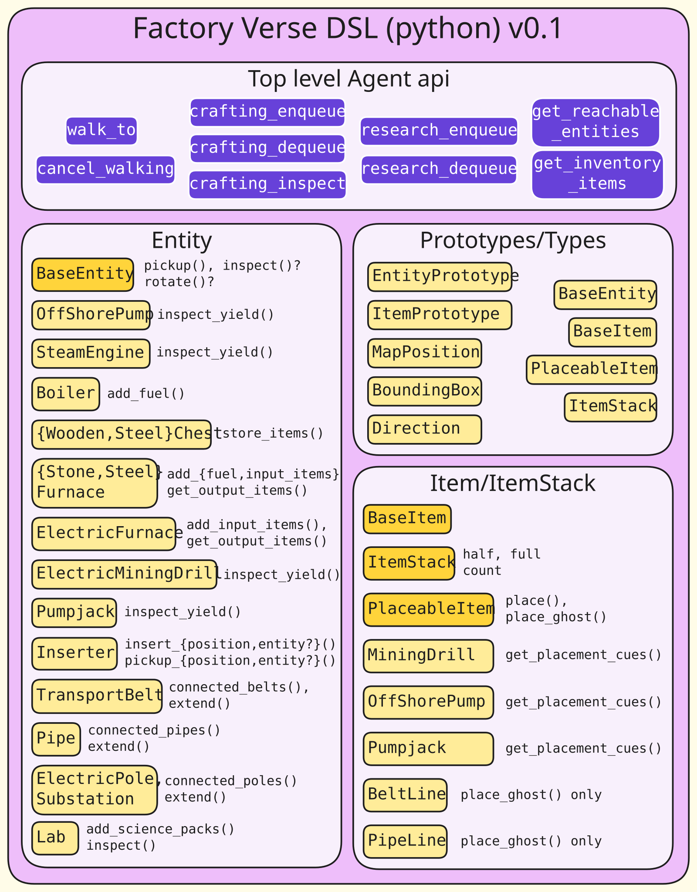

# FactoryVerse

<p align="center"></p>

A research platform for LLM agents playing Factorio.

The agent may do what a person at the keyboard can do, and no more. Three Lua mods replicate the human's affordances — body actions, the map screen, placement reasoning — and a Python layer puts them in the agent's hands as typed objects, a DuckDB map model, and a small set of tools. The interesting questions are about legibility and turns: what the agent can see, what it is told, and how the world moves while it thinks.

The decisions that shape the system are in [`docs/CONSTITUTION.md`](docs/CONSTITUTION.md). The work in progress is in [`docs/architecture/`](docs/architecture/). Everything else is code.

## Install

Requires Python ≥ 3.12, [uv](https://docs.astral.sh/uv/), Docker (for headless servers), and Factorio 2.0 (for a local client).

```bash
git clone https://github.com/hrshtt/FactoryVerse && cd FactoryVerse
uv sync --group dev
cp .env.example .env    # API keys, Factorio paths
```

## Run

```bash
uv run fv client start --scenario lab-grid          # local client with the mods
uv run fv server start --num 1 --scenario lab-grid  # headless server(s) in Docker
uv run fv run -p deepseek                            # freeplay agent against it
uv run fv run --task iron_plate_throughput           # a verified task
uv run fv run --interactive                          # human-in-the-loop REPL
uv run fv campaign --help                            # external-harness campaigns
```

`fv --help` lists everything. Providers: `prime_intellect` (default), `deepseek`, `openai`, `azure`, `local`; each reads its own API key from the environment.

## Test

```bash
uv run pytest tests/unit -q     # offline
uv run pytest tests/live -q     # needs a running instance; skips otherwise
```

## Layout

| Path | What |
|---|---|
| `src/FactoryVerse/environment/` | Orchestrator every entry point composes |
| `src/FactoryVerse/game/` | Agent surface, entity objects, DuckDB map model |
| `src/FactoryVerse/infra/` | RCON/UDP, Docker, LLM clients, sessions |
| `src/FactoryVerse/evals/` | Freeplay campaigns |
| `src/fv_embodied_agent/` | Lua mod — the body |
| `src/fv_snapshot/` | Lua mod — the map |
| `src/fv_placement_hints/` | Lua mod — placement reasoning |
| `src/factorio/` | Scenarios and server config |
| `docs/` | Constitution, plans, runtime-loaded prompts |

See [`AGENTS.md`](AGENTS.md) for the constraints that matter when changing code.
