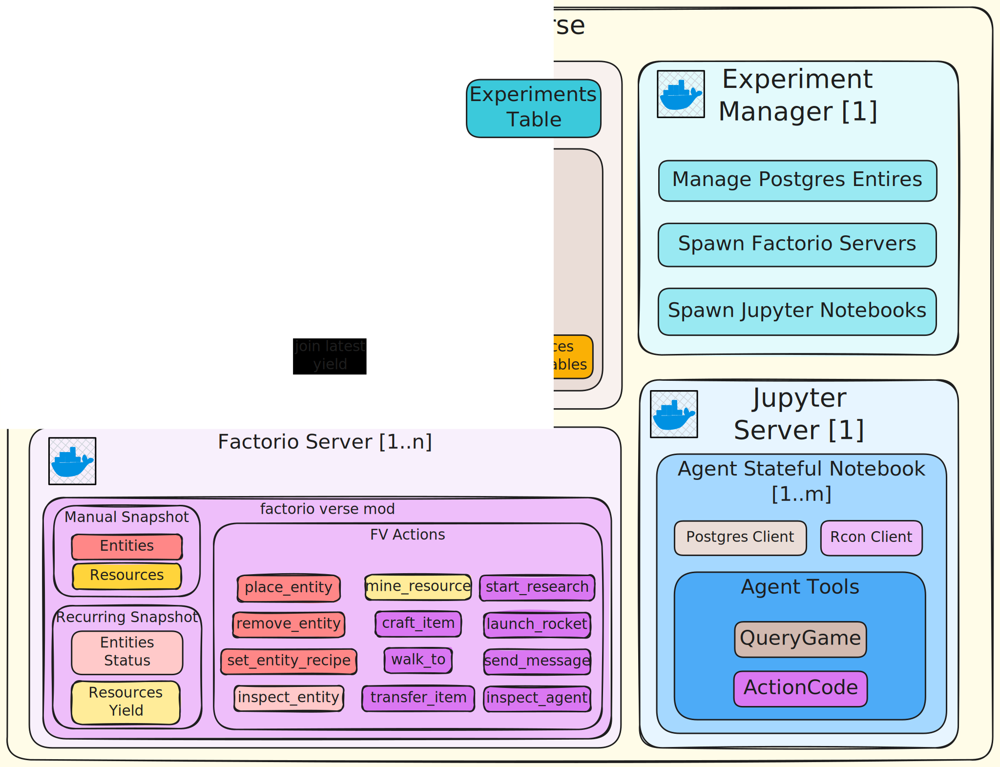

# FactoryVerse

This repository explores the intersection of Large Language Models and complex systems optimization through the lens of Factorio gameplay. FactoryVerse treats Factorio not as a collection of objects to manipulate, but as a rich, spatial dataset to be analyzed, queried, and optimized at scale.

## Research Directions

FactoryVerse investigates two primary research questions:

1. **Game State as Spatial Dataset**: How can we model complex game environments as queryable, spatial databases that enable sophisticated analytical reasoning rather than purely reactive gameplay?

2. **Lua Mod Architecture for AI Research**: What mod design patterns best support systematic ablation studies, controlled experiments, and reproducible AI agent evaluation in complex simulation environments?

## The Factorio Game Loop

Understanding Factorio's core progression is essential for designing effective AI agents. The gameplay follows a tightening flywheel pattern:

### Primary Loop
1. **Prospect → Extract**: Locate resource patches; transition from manual mining to automated drilling systems
2. **Process → Assemble**: Smelt raw ores into intermediate materials; construct science pack production chains
3. **Research → Unlock**: Feed science packs to laboratories to advance the technology tree, unlocking higher-tier automation
4. **Scale → Optimize**: Expand production throughput, refactor inefficient layouts, increase sustained science-per-minute
5. **External Pressure → Defend**: Manage pollution-driven enemy evolution; clear expansion areas and establish defensive perimeters
6. **Culminate → Launch**: Construct and fuel a rocket silo; launching the satellite triggers primary victory condition

### Post-Victory Loop (Optional)
7. **Infinite Research**: Rocket launches yield space science packs that fuel repeating technologies, enabling long-term factory optimization beyond the win condition

### Success Criteria
- **Primary**: First rocket launch (victory screen)
- **Secondary**: Sustainable defense against evolving enemies, increasing science-per-minute throughput, continuous technological progression

The loop forms an accelerating flywheel: **Extract → Automate → Research → Scale → Repeat → Launch** — with steady-state infinite research sustaining long-horizon optimization.

## The Visual Context Challenge

Human players rely heavily on visual information that provides crucial gameplay context:

- **Spatial Validity**: Visual indicators for valid entity placement locations
- **Operational Range**: Highlighted coverage areas for drills, inserters, and other range-limited entities  
- **System Dynamics**: Animated sprites indicating flow rates, operational status, and bottlenecks
- **Multi-Scale Views**: Zoom levels that reveal different abstractions (individual machines vs. factory zones vs. global logistics)
- **Resource Flows**: Belt animations, pipe contents, and inventory states
- **Threat Assessment**: Pollution clouds, enemy base locations, and defensive coverage

These visual cues are difficult to capture for text-based LLMs without enabling direct screen observation across multiple frames to understand dynamics.

## Context on the Table

<p align="center">
  
</p>


Rather than relying on visual interpretation or reactive object access, FactoryVerse makes implicit game context explicit through a queryable spatial database approach:

### Spatial Intelligence
- **PostGIS Integration**: Leverage mature spatial database capabilities for complex geometric queries
- **Multi-Scale Queries**: Query factory state at different levels of abstraction (entity-level → spatial-level → global logistics)
- **Proximity Analysis**: Identify spatial relationships, coverage gaps, and optimization opportunities

### Temporal Analytics  
- **Production Flow Analysis**: Track resource throughput rates, identify bottlenecks, and optimize production ratios
- **Evolution Tracking**: Monitor pollution spread, enemy base expansion, and defensive coverage over time
- **Performance Metrics**: Sustained science-per-minute, resource efficiency, and factory growth patterns

This is attempting an opinionated equivelence between the game state mapped onto sql tables.

### Context Materialization
Instead of requiring LLMs to infer context from visual cues, FactoryVerse materializes this information as queryable data:

```sql
-- Find the best iron ore patches near your factory
SELECT 
  resource_name,
  total_amount,
  ST_Distance(centroid, ST_Point(0, 0)) AS distance_from_spawn
FROM sp_resource_patches 
WHERE resource_name = 'iron-ore'
ORDER BY total_amount DESC, distance_from_spawn ASC;

-- Check which resources aren't being mined yet
SELECT resource_name, COUNT(*) as uncovered_patches
FROM sp_resource_patches rp
WHERE NOT EXISTS (
  SELECT 1 FROM raw_entities e 
  WHERE e.name LIKE '%mining-drill%' 
    AND ST_DWithin(rp.centroid, ST_Point(e.pos_x, e.pos_y), 2)
)
GROUP BY resource_name;

-- Find water sources for offshore pumps
SELECT patch_id, coast_length, total_area
FROM get_water_coast(NULL)
WHERE coast_length > 20
ORDER BY coast_length DESC;
```

### Architecture Benefits

1. **Analytical Reasoning**: Enables system-level optimization rather than purely reactive object manipulation
2. **Scalable Observation**: Query exactly what's needed rather than loading entire game state
3. **Flexible Abstraction**: Create novel views and analyses

## Mod Design: Game State, Snapshots, and the Action Interface

FactoryVerse’s mod treats Factorio as an explicit, serializable game state with a small, principled interface for mutation. The design makes the world easy to dump, transmit, validate, and change predictably—so agents can reason over data and apply actions safely.

### Game State and Snapshots
- **First-class game state**: The world is modeled as a relatively stable state (outside autonomous agents like biters). It can be materialized, compressed, and shipped.
- **Snapshot base**: `core/Snapshot.lua` defines a standard envelope (schema_version, surface, timestamp, data) plus a component schema that flattens nested structures and pushes complex fields into JSON-like columns for efficient ingestion.
- **Categories**: Multiple snapshot categories with dedicated implementations:
  - **Resources** (`snapshots/ResourceSnapshot.lua`): What exists on a fresh map (ores, oil, rocks). High-throughput, chunked CSV streaming with optional UDP, flush thresholds, and compression for bulk ingestion.
  - **Entities** (`snapshots/EntitiesSnapshot.lua`): Everything that appears through play—placed from saves or by players/agents. Includes derived components (belts, pipes, inventories, crafting state) flattened into a stable, query-ready shape.
  ... etc.
- **Upsert-friendly**: Standardized, columnar-oriented output enables efficient storage and straightforward upserts when incrementally updating downstream state.

### Actions: Parameters, Validation, and Context
- **Action base**: `core/action/Action.lua` provides lifecycle and a uniform contract: a `name`, a typed `params` spec, shared validators, and `run`.
- **Parameter spec**: `core/action/ParamSpec.lua` declares required/optional fields, types, and defaults. Params normalize from raw tables or JSON, then validate before any mutation.
- **Context**: Actions execute with an expectation of the current game state plus their own invocation parameters—mirroring how players “intend” sensible operations.

### Validators and Reuse
- **Nested validators**: Validators live alongside actions and categories (e.g., `actions/validator.lua`, `actions/entity/validator.lua`, `actions/entity/place/validator.lua`) and are shared/composed.
- **Registry with patterns**: `core/action/ValidatorRegistry.lua` supports wildcards (e.g., `*`, `entity.*`) and exact names, so common constraints apply broadly while specific checks attach to individual actions.
- **Automatic wiring**: `core/action/ActionRegistry.lua` loads actions, attaches validators, aggregates any event handlers, and exposes a single remote interface.

### Execution Lifecycle and Hooks
- **Pre-run**: `_pre_run` coerces JSON → params, applies `ParamSpec` checks, then runs logical validators. Any failure surfaces early.
- **Run**: The action performs a meaningful, game-valid change and returns a small result describing what changed.
- **Post-run**: `_post_run` funnels results into centralized mutation logging. This yields clean pre/post hooks for cross-cutting behaviors without action-local boilerplate.

### Mutation Logging
- **Central logger**: `core/mutation/MutationLogger.lua` records incremental changes as JSONL, reusing snapshot serializers where helpful (e.g., entity serialization). Output lands in `script-output/factoryverse/mutations`.
- **Result contract**: Actions return lightweight hints (e.g., `affected_unit_numbers`, optional `affected_resources`, optional `affected_inventories`) that the logger resolves into rich records. See `docs/action-postrun-logging-plan.md` for the phased plan.
- **Runtime control**: `core/mutation/MutationConfig.lua` enables minimal/full/disabled profiles. `control.lua` sets a conservative default and can enable future tick-based logging.

### Remote Interface, Invocation, and Queues
- **Direct remote calls**: `ActionRegistry` registers all actions on a single remote interface (`actions`) so external clients can invoke them individually via `remote.call("actions", "category.action", params)`.
- **Queue-based batching (experimental)**: `core/action/ActionQueue.lua` exposes an `action_queue` remote interface that lets clients enqueue many actions and process them together (by key or all at once). This reduces per-call overhead (e.g., over rcon) and improves stability for multi-agent coordination by validating and sequencing batches. Convenience methods (`queue_category.action`) exist alongside generic `enqueue`, with controls for immediate mode, priorities, sizes, and per-key processing.

Together, these pieces form a compact environment interface: snapshots make context explicit and cheap to move; actions apply validated, sensible changes; mutation logs capture what happened for downstream analytics and learning.

## Python DSL: Type-Safe Entity Operations


<p align="center">
  
</p>

FactoryVerse provides a Python Domain-Specific Language (DSL) that enables type-safe, context-aware operations on Factorio entities. The DSL bridges the gap between the Lua mod's remote interface and Python agent code, providing a clean, Pythonic API that reflects Factorio's gameplay semantics.

### Design Philosophy

The DSL is built around three core principles:

1. **Type Safety**: Entity types are represented as Python classes with type-specific methods, preventing invalid operations (e.g., you can't set a recipe on a mining drill)
2. **Context Awareness**: Operations automatically access the active gameplay session through context variables, eliminating the need for explicit factory passing
3. **Prototype-Driven Behavior**: Static entity properties (output positions, search areas, connection points) are derived from Factorio's prototype data, ensuring accuracy and consistency

### Context Management

All entity operations require an active gameplay context, provided by the `playing_factory` context manager:

```python
from src.FactoryVerse.dsl.agent import playing_factory
from src.FactoryVerse.dsl.types import MapPosition

with playing_factory(rcon_client, agent_id):
    # All entity operations here
    drill = ElectricMiningDrill(...)
    output_pos = drill.output_position()
```

The context manager sets up a thread-local context variable that entities and top-level functions automatically access, ensuring operations only execute within a valid gameplay session.

### Entity Types and Operations

Entities are represented as typed Python classes, each with domain-specific methods:

```python
# Mining drills - extract resources
drill = ElectricMiningDrill(name="electric-mining-drill", position=MapPosition(10, 20), ...)
output_pos = drill.output_position()  # Get output tile position
search_area = drill.get_search_area()  # Get resource search bounding box

# Inserters - move items between entities
inserter = Inserter(...)
pickup_pos = inserter.get_pickup_position()  # Where inserter picks up items
drop_pos = inserter.get_drop_position()  # Where inserter drops items

# Furnaces - smelt ores into plates
furnace = Furnace(...)
furnace.add_fuel(coal_stack)  # Add fuel (accepts Item or ItemStack)
furnace.put_input_items(iron_ore_stack, count=50)  # Add ore to smelt
plates = furnace.take_output_items(iron_plate_stack)  # Extract smelted plates

# Assembling machines - craft items
assembler = AssemblingMachine(...)
assembler.set_recipe("iron-gear-wheel")  # Set what to craft
input_type = assembler.get_input_type()  # Query recipe requirements
output_type = assembler.get_output_type()  # Query recipe outputs
```

### Prototype System

Static entity properties are accessed through a singleton prototype system that loads data from Factorio's prototype definitions:

```python
# Prototypes provide spatial calculations based on entity definitions
drill.prototype.output_position(centroid, direction)  # Calculate output tile
drill.prototype.get_resource_search_area(centroid)  # Calculate mining area
inserter.prototype.pickup_position(centroid, direction)  # Calculate pickup tile
```

Prototypes are instantiated once and shared globally, ensuring efficient memory usage and consistent behavior across all entity instances.

### Items and Placement

Items in inventory are represented as `Item` and `ItemStack` objects. Placeable items can be placed as entities:

```python
# Regular placeable items
chest_item = PlaceableItem(name="wooden-chest", ...)
chest_entity = chest_item.place(MapPosition(10, 20))

# Special items requiring placement cues (mining drills, pumpjacks, offshore pumps)
drill_item = MiningDrillItem(name="electric-mining-drill", ...)
cues = drill_item.get_placement_cues()  # Get valid placement positions
if cues:
    entity = drill_item.place(
        MapPosition(cues[0]["position"]["x"], cues[0]["position"]["y"]),
        Direction(cues[0].get("direction", 0))
    )
```

### Top-Level Functions

The DSL provides convenient top-level functions for common operations, automatically accessing the gameplay context:

```python
from src.FactoryVerse.dsl.dsl import walk_to, craft_enqueue, get_reachable_entities

with playing_factory(rcon, agent_id):
    # Movement
    walk_to(MapPosition(10, 20))
    cancel_walking()
    
    # Crafting
    craft_enqueue("iron-plate", count=5)
    craft_dequeue("iron-plate", count=2)
    
    # Research
    research_enqueue("automation")
    research_dequeue()
    
    # Observation
    entities = get_reachable_entities()
    inventory = get_inventory_items()
```

### Type System Benefits

The typed DSL provides several advantages over string-based APIs:

1. **IDE Support**: Autocomplete and type checking catch errors before runtime
2. **Semantic Clarity**: Method names reflect gameplay actions (`add_fuel` vs `put_inventory_item`)
3. **Invalid Operation Prevention**: Type system prevents impossible operations (e.g., setting recipes on non-crafting entities)
4. **Refactoring Safety**: Type information enables safe code changes and better tooling support

### Integration with Spatial Queries

The DSL integrates seamlessly with FactoryVerse's spatial database approach. Entities can be created from query results:

```python
# Query entities from DuckDB
entities_data = map_view.query("""
    SELECT name, pos_x, pos_y, direction, bounding_box
    FROM raw_entities
    WHERE name = 'electric-mining-drill'
""")

# Convert to typed entities
from src.FactoryVerse.dsl.entity.base import ElectricMiningDrill
from src.FactoryVerse.dsl.types import MapPosition, BoundingBox, Direction

drills = [
    ElectricMiningDrill(
        name=row["name"],
        position=MapPosition(row["pos_x"], row["pos_y"]),
        bounding_box=BoundingBox.from_tuple(row["bounding_box"]),
        direction=Direction(row["direction"])
    )
    for row in entities_data
]

# Now use typed methods
with playing_factory(rcon, agent_id):
    for drill in drills:
        output_pos = drill.output_position()
        search_area = drill.get_search_area()
```

This combination of spatial queries for observation and typed DSL for action provides a powerful interface for AI agents to reason about and interact with the Factorio world.

## Getting Started

[Installation and usage instructions would follow here, for sure]

## Research Applications

FactoryVerse enables investigation of several research questions in AI systems:

- **Multi-Scale Planning**: How do agents balance local optimization vs. global factory efficiency?
- **Spatial Reasoning**: Can LLMs effectively perform complex geometric and logistical reasoning through SQL interfaces?
- **System Dynamics**: How well can text-based models understand and optimize complex feedback loops?
- **Long-Horizon Optimization**: What strategies emerge for infinite research and continuous improvement scenarios?

## Appendix

### Spatial Types

Factorio is a 2d grid based world, the relavant game world precision is integer level, IFF you ignore real player position, vehicle position and mine placement.
In other words everything else on the map snaps on an integer coordinate grid, with the smallest 1x1 size of this world called a tile.

While entities have centers that can be at half-tile coordinates (e.g., x + 0.5), we can represent them using their bottom-left corner coordinates and dimensions instead. This transformation converts all spatial data to integer coordinates, enabling fast spatial indexing and efficient database queries.

**Spatial Types (ST) Standards**: PostGIS implements the OGC Simple Features specification, providing standardized geometry types for spatial databases. For Factorio's 2D grid world, the most relevant types are: **Point** (entity centers, resource deposits), **Polygon** (building footprints, resource patches), **LineString** (conveyor belts, pipe networks), and **MultiPolygon** (complex resource areas). These types enable precise spatial queries like proximity analysis, coverage calculations, and optimal routing—transforming Factorio's implicit spatial relationships into queryable database operations.

---

*FactoryVerse: Complex Systems need Intelligent Analysis*